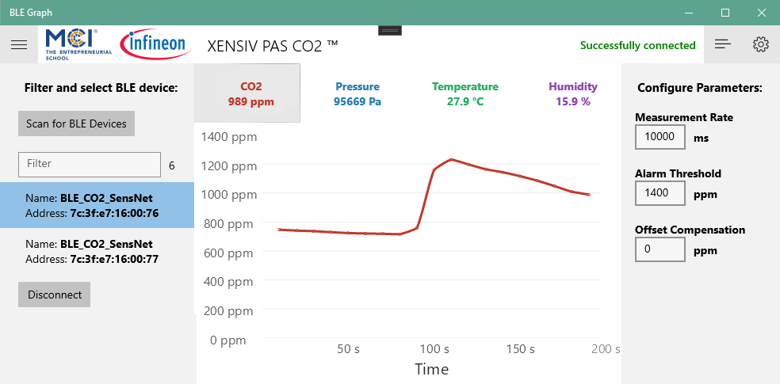

<!--
*** Thanks for checking out the Best-README-Template. If you have a suggestion
*** that would make this better, please fork the repo and create a pull request
*** or simply open an issue with the tag "enhancement".
*** Thanks again! Now go create something AMAZING! :D
-->

<!-- PROJECT SHIELDS -->
<!--
*** I'm using markdown "reference style" links for readability.
*** Reference links are enclosed in brackets [ ] instead of parentheses ( ).
*** See the bottom of this document for the declaration of the reference variables
*** for contributors-url, forks-url, etc. This is an optional, concise syntax you may use.
*** https://www.markdownguide.org/basic-syntax/#reference-style-links
-->
[![Contributors][contributors-shield]][contributors-url]
[![Forks][forks-shield]][forks-url]
[![Stargazers][stars-shield]][stars-url]
[![Issues][issues-shield]][issues-url]
<!-- [![MIT License][license-shield]][license-url] -->

<!-- PROJECT LOGO -->
 

  
   
  

  <h3 align="center"></h3>

  

    A Windows app to monitor the PAS CO2 Sensor Boards produced by MCI Emerging Applications Lab 
     
    <!-- <a href="https://github.com/Infineon/AQM-Windows-App"><strong>Explore the docs »</strong></a> 
     -->
     
    <!-- <a href="https://github.com/Infineon/AQM-Windows-App">View Demo</a> 
    ·
    -->
    <a href="https://github.com/Infineon/AQM-Windows-App/issues">Report Bug</a>
    ·
    <a href="https://github.com/Infineon/AQM-Windows-App/issues">Request Feature</a>
  

<!-- TABLE OF CONTENTS -->

  
<h2 style="display: inline-block">Table of Contents</h2>

  <ol>
    <li><a href="#description">Description</a></li>
    <li><a href="#getting-started">Getting Started</a></li>
    <li><a href="#usage">Usage</a></li>
    <li><a href="#contact">Contact</a></li>
    <li><a href="#acknowledgements-and-resources">Acknowledgements and Resources</a></li>
  </ol>

## Description

This project aims to implement a GUI to monitor and configure [PAS CO2 SensorNetwork](https://github.com/Infineon/AQM-Sensorhub) Boards.

<!-- GETTING STARTED -->
## Getting Started

The application is developed as an UWP App in [Visual Studio 2019 Community](https://visualstudio.microsoft.com/de/downloads/). 

In order to execute it you need to download and extract the file into a directory. Then open the "BLE Graph.sln" file in Visual Studio and start it with F5.

Note: This app can only be run with Windows 10 1809 or newer. This is because some of the used .Net Core Features are limited to newer Versions of Windows.

<!-- USAGE -->
## Usage

On the left you can filter and click on one of the Sensor Boards to establish a connection to it. After that you can click on one of the values above to get the graph on this value or use the boxes on the right to configure it. The menu and configuration buttons on top left and right corner can be used to hide the according panels.

<!-- CONTACT -->
## Contact

<!-- Your Name - [@twitter_handle](https://twitter.com/twitter_handle) - email -->

Project Link: [https://github.com/Infineon/AQM-Windows-App](https://github.com/Infineon/AQM-Windows-App)

by Rene Santeler - MCI Emerging Applications Lab - 6020 Innsbruck, in cooperation with Infineon

<!-- ACKNOWLEDGEMENTS & RESOURCES -->
## Acknowledgements and Resources

* [Infineon - AQM-Sensorhub](https://github.com/Infineon/AQM-Sensorhub)
* [Infineon - AQM-Android-App](https://github.com/Infineon/AQM-Android-App)
* [Microsoft - Bluetooth Low Energy sample](https://docs.microsoft.com/en-us/samples/microsoft/windows-universal-samples/bluetoothle/)
* [beto-rodriguez - LiveCharts2](https://github.com/beto-rodriguez/LiveCharts2)
* [othneildrew - Best-README-Template](https://github.com/othneildrew/Best-README-Template)

<!-- MARKDOWN LINKS & IMAGES -->
<!-- https://www.markdownguide.org/basic-syntax/#reference-style-links -->
[contributors-shield]: https://img.shields.io/github/contributors/MechResato/DeflectionAnalyzer.svg?style=for-the-badge
[contributors-url]: https://github.com/Infineon/AQM-Windows-App/graphs/contributors
[forks-shield]: https://img.shields.io/github/forks/MechResato/DeflectionAnalyzer.svg?style=for-the-badge
[forks-url]: https://github.com/Infineon/AQM-Windows-App/network/members
[stars-shield]: https://img.shields.io/github/stars/MechResato/DeflectionAnalyzer.svg?style=for-the-badge
[stars-url]: https://github.com/Infineon/AQM-Windows-App/stargazers
[issues-shield]: https://img.shields.io/github/issues/MechResato/DeflectionAnalyzer.svg?style=for-the-badge
[issues-url]: https://github.com/Infineon/AQM-Windows-App/issues
<!-- [license-shield]: https://img.shields.io/github/license/MechResato/DeflectionAnalyzer.svg?style=for-the-badge -->
<!-- [license-url]: https://github.com/Infineon/AQM-Windows-App/blob/master/LICENSE.txt -->
